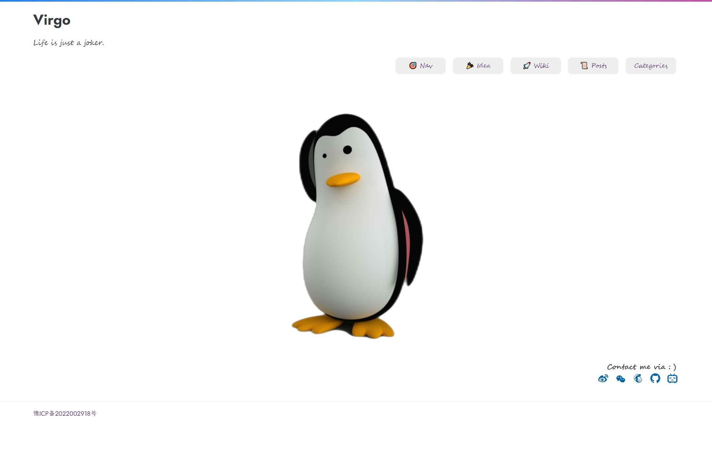
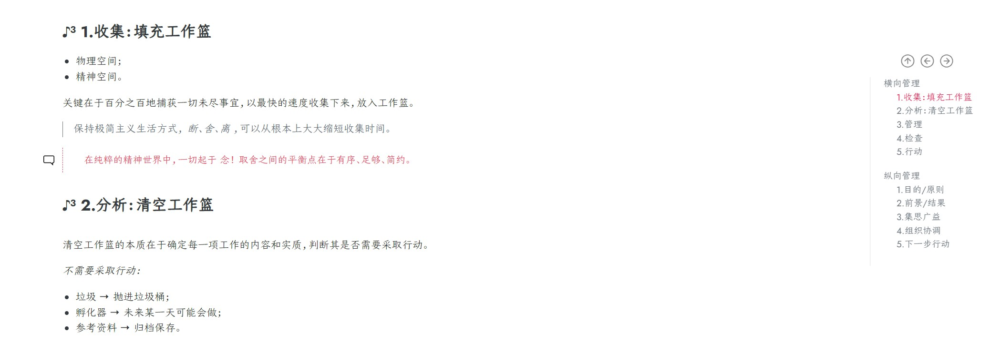
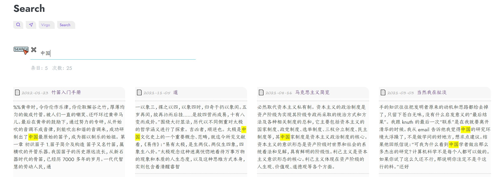

It's just a simple & pure theme. 🎉🎉🎉

## Overview



## Features In-built

1、A highlight TOC with relative headline, like this:



2、A simple and realtime local search.



## Tips

Maybe you need to create some `.md` files which are necessary for right routes, like:

| Markdown File        | Route      |
| -------------------- | ---------- |
| `content/nav.md`     | `/nav`     |
| `content/search.md`  | `/search`  |
| `content/archive.md` | `/archive` |

## Quick Start

First, let's try to start a interesting journey.

```sh
cd YOUR_SITE_DIR	# your local site workspace
git clone https://github.com/loveminimal/hugo-theme-virgo.git themes/virgo
# OR
cd YOUR_SITE_DIR/themes
git submodule add https://github.com/loveminimal/hugo-theme-virgo.git virgo
```

> Which one to choose? If you have this question, just choose the first. 😏

Then, update your `config.toml` of site, like this:

```
baseURL = 'https://ovirgo.com/'
languageCode = 'zh-cn'
title = 'Virgo'

theme = 'virgo'
hasCJKLanguage = true
summaryLength = 80    # default 70
paginate = 24         # better 4 * 3 * times

[params]
    # active fadeIn animate when load page
    hasActiveAnimate = true                
    # active cool style, be cool but take up more resources
    hasActiveCool = true  

    # like the following items that you need create a relative markdown file
    # Search - search.md
    # Nav - nav.md 
    # Archive - archive.md
    # Idea posts/idea.md 
    # Wiki - posts/wiki.md
    hasMoreMenuItems = true

    slogan = 'Life is just a joker.'       # your site slogan below title
    [params.svg]
        color = '#6c757d'                  # icon color of breadcrumb '#666'  # '#5a29e4' 
    [params.img]
        # Img of home page - if not jpg, rename it, and
        # place it inio `static/imgs/` dir
        # In-built : lightcolor, girl, and tux
        src = 'tux'
        width = 880


    [params.contact]
        icp = '豫ICP备2022002918号'          # beian number
        weibo = '6867589681'                # e.g. https://weibo.com/u/6867589681
        wechat = 'bg/wechat.jpg'            # Wechat QR, choose your path
        email = 'loveminimal@outlook.com'
        github = 'loveminimal'              # e.g. https://github.com/loveminimal
        bilibili = '11608450'               # e.g. https://space.bilibili.com/11608450
        color = '#5d2f86'                   # icon color of contact

[markup]
    [markup.asciidocExt]
        preserveTOC = true
    [markup.highlight]
        style = "github"
        lineNos = false
    [markup.tableOfContents]
        endLevel = 3
        ordered = false
        startLevel = 2
    [markup.goldmark]
        [markup.goldmark.renderer]
            unsafe = true
```

Now, just run `hugo server -D` to enjoy it.
