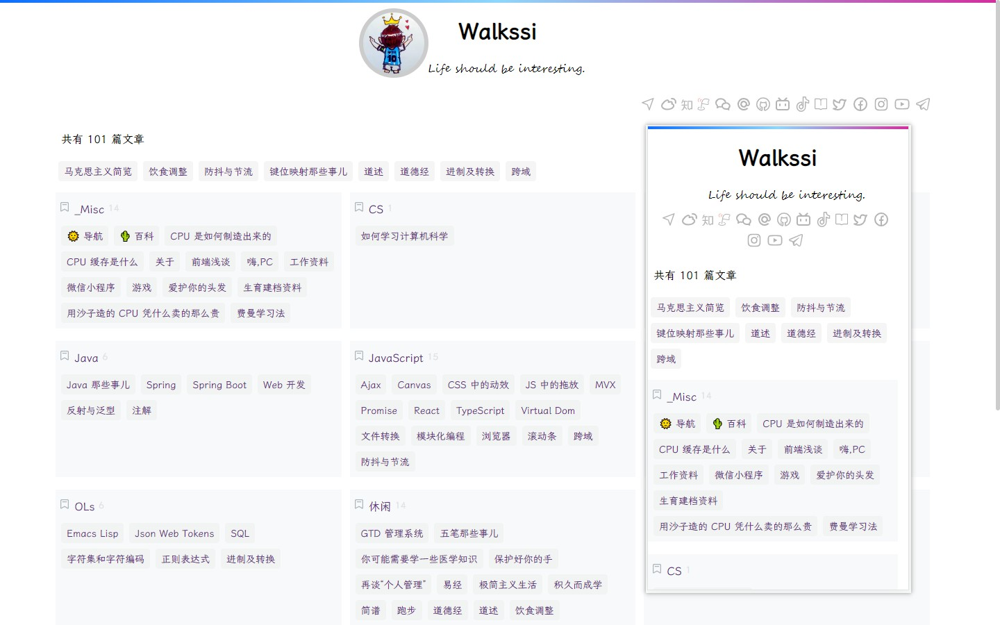

> 我们应该用一种真心让自己感觉到舒适的方式去生活，不就奢华，不饰节俭。

| 条目     | 链接                                                         | 备注   |
| -------- | ------------------------------------------------------------ | ------ |
| 使用指南 | [📘 如何使用 hugo-theme-virgo 主题](https://aituyaa.com/%E5%A6%82%E4%BD%95%E4%BD%BF%E7%94%A8-hugo-theme-virgo-%E4%B8%BB%E9%A2%98/) |        |
| 主题仓库 | [🎨 hugo-theme-virgo](https://themes.gohugo.io/themes/hugo-theme-virgo/) |        |
| 新版预览 | [👀 新版本预览](https://aituyaa.com)                          | 精简版 |
| 旧版预览 | [👀 旧版本预览](https://aituyaa.github.io)                | 完整版 |

> **为什么要把使用指南单独列出，而不是放在 README 中？**

一方面，内容更新频繁（虽然没有必要），把更改放在 `README` 中需要每次都提交主题更新，然而多数时候只是单纯地更新 `README` 而已。

另一方面，国内网络推送到 Github 仓库的时候经常抽风，速度也慢。

[**> 新版本预览**](https://aituyaa.com)

’她‘更新了：

- 移除本地全局搜索功能（用的不多）；
- 页面归并改造
  - 移除独立的文章页、归档页入口
  - 归档页精简为只显示标签列表（Obsidian 只支持标签），置于首页
  - 更新导航页
- 移除相邻文章切换功能（使用不多）
- 精简配置项
- ……

[**> 旧版本预览**](https://aituyaa.github.io)

‘她’包含：

- 两种模式：纯净、酷爽，
- 内置但不限于精美的本地字体，
- 高亮的层级目录，以及
- 简单强大的本地文章实时搜索功能等。

欢迎体验 ： ） 
