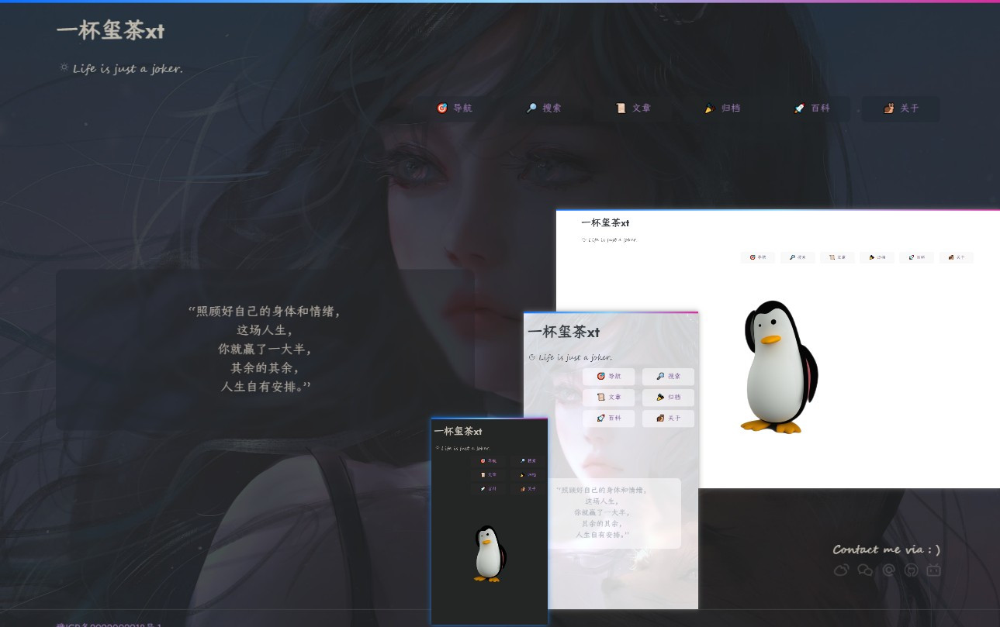

[🎨 hugo-theme-virgo](https://themes.gohugo.io/themes/hugo-theme-virgo/)

[🧪 Demo / 演示](https://loveminimal.github.io/)

## 简介

一个简单纯净的主题，欢迎使用。🎉🎉🎉 



‘她’包含：
- 两种模式：纯净、酷爽，
- 内置但不限于精美的本地字体，
- 高亮的层级目录，以及
- 简单强大的本地文章实时搜索功能等。


## 更新日志

```
- 2023-03-23 14:58 增加 utterances 评论插件
- 2023-03-22 16:08 更新主页快捷联系选项，增加知乎和简书
- 2023-03-21 17:58 更新导航页面文件结构 - `nav.md` 或 `nav/index.md`
- 2023-03-19 00:05 优化导航页面快速跳转
```

## 快速开始

首先，下载该主题。

```sh
cd YOUR_SITE_DIR	# 本地站点目录
git clone https://github.com/loveminimal/hugo-theme-virgo.git themes/virgo
# OR
cd YOUR_SITE_DIR
git submodule add https://github.com/loveminimal/hugo-theme-virgo.git themes/virgo
```

> 💡 使用哪种方式呢？如果你有这个疑问，那么就选择第一种。

然后，更新你站点的 `config.toml` 内容，如下（后续可按需修改）：

```toml
baseURL = 'https://walkssi.com/'
languageCode = 'zh-cn'
title = 'Walkssi'

# 启用主题
theme = 'virgo'

hasCJKLanguage = true
summaryLength = 80
paginate = 11
enableGitInfo = true

[params]
    author = 'Jack'
    slogan = 'Life should be interesting.' # 'Life is just a joker.'

    # 页面语言，默认中文
    en = false
    # 英文首页标题，默认 'Virgo'
    homeTitleEn = 'Walkssi'
    # 中文首页标题，默认 ‘一晌贪欢’
    homeTitleZh = '遛达西'

    # 激活暗色模式，
    # 由于静态页面的限制，我们使用浏览器本地存储来记忆该状态，
    # 如果设置为 `true` 后，默认不是暗色模式，清除浏览器缓存后刷新页面即可
    dark = false

    # 文章列表页单列显示
    isSingleColumnOfPostList = true

    # 是否显示相邻页链接
    isShowPrevNextLink = true

    # 激活页面加载时的过渡动画
    hasActiveAnimate = true

    # 激活 cool 模式，酷爽但是消耗资源也更多，
    # 如果想更换页面背景，只需要将图片命名为 `default.jpg` 后，置于 `/static/imgs/bg` 文件夹中即可，
    # 浏览器有缓存，更换后强制页面刷新（快捷键为 Ctrl+Shift+R）一下即可
    hasActiveCool = false

    # 展开/折叠代码块，默认不折叠，
    # 设置为 `true` ，则默认折叠所有代码块，
    # 提示，在移动设备中，系统设置为永久折叠代码块
    # (该项设置不重要，完全是个人喜好)
    hasFoldAllCodeBlocks = false

    # 如下导航链接，你应该创建对应的 `.md` 文件，以生成对应的页面
    # -----------------------------------
    # Nav - nav.md or nav/index.md 
    # Search - search.md or search/index.md
    # Archive - archive.md or archive/index.md
    # Wiki - posts/wiki.md or wiki/index.md
    # About - about.md or about/index.md
    # -----------------------------------
    # 菜单选项定制，使用 `00、01、23` 等进行选项顺序调整
    # 🐶🎉👀💡👓🐌
    [params.menu]
        [params.menu.00]
            active = true
            path = '/nav'
            en = 'Nav'
            zh = '导航'
            icon = '🎯'
        [params.menu.11]
            active = true
            path = '/search'
            en = 'Search'
            zh = '搜索'
            icon = '🔎'
        [params.menu.22]
            active = true
            path = '/posts'
            en = 'Posts'
            zh = '文章'
            icon = '📜'
        [params.menu.33]
            active = true
            path = '/archive'
            en = 'Archive'
            zh = '归档'
            icon = '🎉'
        [params.menu.44]
            active = true
            path = '/notes'
            en = 'Notes'
            zh = '草稿'
            icon = '⚗️'
        [params.menu.55]
            active = true
            path = '/about'
            en = 'About'
            zh = '关于'
            icon = '🐌' 
    
    # 首页图片/文字
    [params.img]
        # 如果你不想显示图片，想显示一段话，只需要
        # 设置 `noImgButWords` 为 true 即可
        notImgButWords = false
        # 内置了 `girl.jpg, wukong.jpg, and tux.jpg, cat.svg ……`，当然你可以
        # 把自己喜欢图片放在 `static/imgs/` 目录中，并在 `src` 引用它,
        # 你还可以通过 `width` 调整引入图片的显示大小，
        # 如果，将 `width` 设置为 '' 或 0 ，
        # 将默认使用图片自身分辨率尺寸
        src = 'cat.svg'
        width = 0
        # words = "Stay hungry, Stay foolish. <br>Your time is limited, so don't waste it living someone else's life. <br>Have the courage to follow your heart and intuition. They somehow already know what you truly want to become. Everything else is secondary. <br>-- Steve Jobs."
        # words = "多少事，从来急；<br>天地转，光阴迫。<br>一万年太久，只争朝夕。<br>-- 教员"
        words = "“照顾好自己的身体和情绪，<br>这场人生，<br>你就赢了一大半，<br>其余的其余，<br>人生自有安排。”"

    [params.contact]
        icp = '豫ICP备2022002918号-1'             # 备案号，如果你不想显示，设置为 '' 空即可
        icplink = '//beian.miit.gov.cn'           # 备案链接
        weibo = '6867589681'                     # e.g. https://weibo.com/u/6867589681
        wechat = 'imgs/bg/wechat.jpg'           # 微信二维码地址
        # zhihu = 'loveminimal'                   # e.g. https://www.zhihu.com/people/loveminimal
        # jianshu = 'eebcc2974936'                # e.g. https://www.jianshu.com/u/eebcc2974936
        email = 'loveminimal@outlook.com'
        github = 'loveminimal'                  # e.g. https://github.com/loveminimal
        bilibili = '11608450'                   # e.g. https://space.bilibili.com/11608450
        # twitter = 'loveminimal163'                 # e.g. https://twitter.com/loveminimal163
        # facebook = 'loveminimal'              # e.g. https://facebook.com/loveminimal
        # instagram = 'loveminimal163'          # e.g. https://www.instagram.com/loveminimal163
        # youtube = 'UCkWIBwe3rZTDAmBs0GJngkA' # e.g. https://www.youtube.com/channel/UCkWIBwe3rZTDAmBs0GJngkA
        # telegram = 'loveminimal'                # e.g. https://web.telegram.org/k/#@loveminimal
        color = '#696969'                        # 图标颜色，默认为浅灰色
        slogan = 'Find me via : )'               # 联系标语，不想显示，可以置空

    # 在开发环境下（http://localhost:1313/），不再启用评论插件，
    # 如果想在开发环境下启用它，修改服务端口即可，如下
    # hugo server -p=1314
    [params.utterances]
        active = true                             # 是否启用评论插件
        repo = "loveminimal/comment"               # 输入你的仓库名称
        issueTerm = "pathname"
        theme = "github-light"
        crossorigin = "anonymous"

# 以下为 Markdown 解析擎的一些设置，
# 建议保持不变
[markup]
    [markup.asciidocExt]
        preserveTOC = true
    [markup.highlight]
        # 代码块显示风格、行号显示
        style = "github"
        lineNos = false
    [markup.tableOfContents]
        endLevel = 3
        ordered = false
        startLevel = 2
    [markup.goldmark]
        [markup.goldmark.renderer]
            unsafe = true

```

现在，你就可以运行 `hugo server -D` 开始你的折腾之旅了。

## 导航页

如果，你想使用导航页并正确显示，那么就应该严格按照下面这种格式搭建你的 `nav.md` 文件结构：

```md
---
title: "Nav"
draft: false
---

<div class="nav">

## 🌞 *分类 ONE*
- [mineitem one](/)
- [mineitem two](/archive)
- [mineitem three](https://nav-item-three.com)
 
## 🔨 *分类 TWO*
- [toolitem three](https://nav-item-three.com)

## 📑 *分类 THREE*
- [docitem one](/)
- [docitem two](/archive)
- [docitem three](https://nav-item-three.com)

</div>

## 🔖 *标签 BOOKMARKs*

<div class="bookmark">

- bookmark item one https://bookmark-item-one.com
- bookmark item two https://bookmark-item-two.com
- bookmark item three https://bookmark-item-three.com

</div>
```

为什么要做格式方面的限制呢？

众所周知，Markdown 对 Table 的支持很一般，鉴于导航页的内容主要是外链和书签，使用列表管理是最方便的。另外，我们会使用 JS 进行内容项的统计，所以就需要使用者遵守格式，不然可能页面显示可能会不正常。

## 标记语法增强

`> 使用 JS 对 markdown 做出的一些增强性修改`

不止一次吐槽过 markdown 虽然是纯文本性质的，但是其某些标记语法真的是让人不敢恭维，直观性和表现力都是一般。不过，从另一个方面来说，本来就是轻量级的标记语言，不可能承载太多。

本来想直接修改 markdown 引擎来实现，研究了一下，还要颇费一番工夫。鉴于仅满足于个人使用，用一些曲线方式使用 js 来实现反而更加简单些。

此处就记录一下针对 `hugo-theme-virgo` 做的一些魔改。

### 行内格式

Markdown 中的行内格式有以下几种：

|                      语法                      |     效果      |     转译 html 标签      |
| :--------------------------------------------: | :-----------: | :---------------------: |
|                   `**加粗**`                   |   **加粗**    | `<strong>加粗</strong>` |
|                    `*斜体*`                    |    *斜体*     |     `<em>斜体</em>`     |
|                  `~~删除线~~`                  |  ~~删除线~~   |   `<del>删除线</del>`   |
| ` 行内代码 |`行内代码`|`<code>行内代码</code>` |               |                         |
|                      ---                       | <u>下划线</u> |     `<u>下划线</u>`     |

是的，markdown 中没有下划线的标记语法。

本来想用行内代码的标记格式做魔改，鉴于博文中出现行内的代码的概率较高，遍历起来相对更耗性能（虽然并没有多少），故决定选择 `*斜体*` 语法标记，其使用频率不多，且其对应的 Org Mode 中可以直接显为粗体显示。

|  新增语法   |   效果    |
| :---------: | :-------: |
| `*_下划线*` | *_下划线* |
|  `*=高亮*`  |  *=高亮*  |

~~|  `*-高亮*`  |  *-高亮*  |~~ ❌  
~~| `*=吐槽系*` | *=吐槽系* |~~ ❌

~~如此，我们便增加了 *_下划线* 和 *=高亮* 两种语法标识了。另外，在文章中，尤其是一些摘录和转载的文章中，我们需要做一些随笔，之前我们是使用 `<div class="oh-essay">...</div>` 这种标签插入，如上表，我们也对其做了语法标识。~~

如上，所示，更改了一些语法标记，因为有的 Markdown 引擎中使用 `==高亮==` 来高亮文本，我们这里就用 `*=高亮*` 来表示，以做到在观感上统一。

另外，我们不再使用 `*=吐槽系*` 来表示个人在摘录或编辑中的个人想法展示，主要是由于在不支持当前语法标记的主题中，它只能以斜体展示，不容易和正文内容作区分。我们使用 `>:: 吐槽系` 或 `> :: 吐槽系` 来表示，如此在不支持的情况下，可以解析为引用样式，便于区分。

之前我们做了一些 snippet 进行 html 标签的插入，以实现以上效果，但是这就限定在了某些编辑器中，些许背离了纯文本输入的理念，以上小小的增强，使得我们可以任何文本编辑器中进行方便的文本输入。

```
>:: 好吧，尽管它们只能在 `hugo-theme-virgo` 中才有效果 😅
> ::好吧，尽管它们只能在 `hugo-theme-virgo` 中才有效果 😅
> :: 好吧，尽管它们只能在 `hugo-theme-virgo` 中才有效果 😅
```

上述语法标记是等价的，会被解析为如下样式：

```
🗨️ | 好吧，尽管它们只能在 hugo-theme-virgo 中才有效果 😅
```

### 代码块折叠

在 Markdown 中，包裹代码块很方便。但有时候在博文中，我们可能引入较多的代码片段，这会导致正文内容的间断，所以，允许其进行折叠，可以在 `config.tom` 中，使用 `hasFoldAllCodeBlocks: true` 进行初始化。

既然已经可以折叠了，这里我们不妨用它再做一个更通用的折叠板（默认折叠），原理也很简单，利用 `lang` 判别。

如果其为 `_lang` 这种格式，则表示轻量级代码折叠 - 不换行；如果使用 `__lang` 则折叠板中内容会自动换行。

### Wiki 链接及图片语法渲染

最近使用 Obsidian ，其使用的链接及图片格式为 Wiki 语法，如下：

| 名称           | 描述                      |
| -------------- | ------------------------- |
| 链接           | `[[link]]`                |
| 链接（带描述） | `[[link \| desc]]`        |
| 图片           | `![[path/to/img]]`        |
| 图片（带尺寸） | `![[path/to/img \| 200]]` |

Hugo 默认的 Markdown 引擎是不支持渲染这种语法的，我们这里做了一下增强，现在你可以畅快地使用 Obsidian 来编辑你的博客了。

>= 图片和链接，好像 Wiki 的这种语法写起来更加简洁。其实，还是使用 ` ` 标签的通用性更好些，不过许多软件的即时渲染又不支持，就很伤。

## 结语

制作主题，对 ‘强迫症’ 来说，真的是 ……