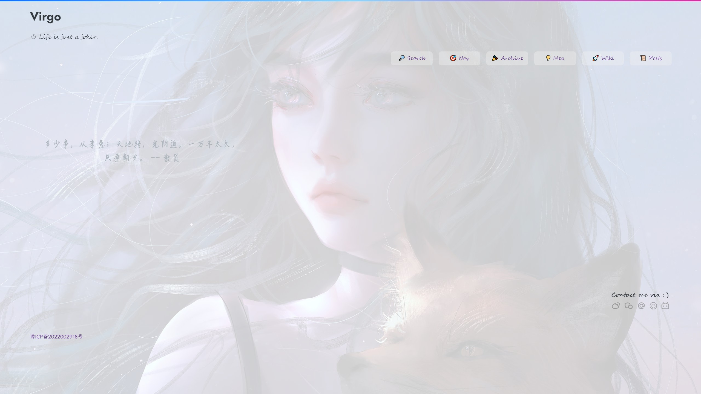
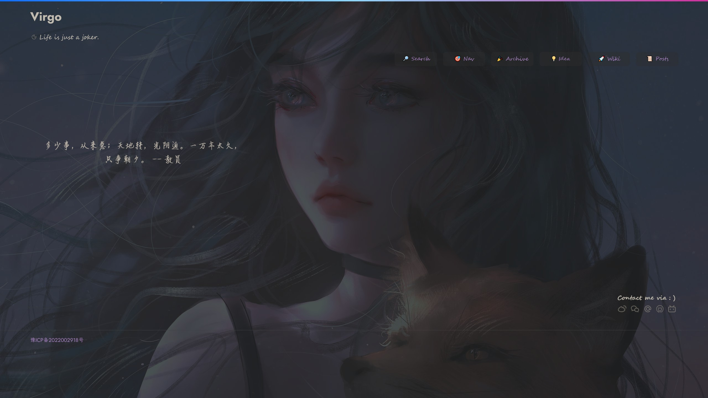
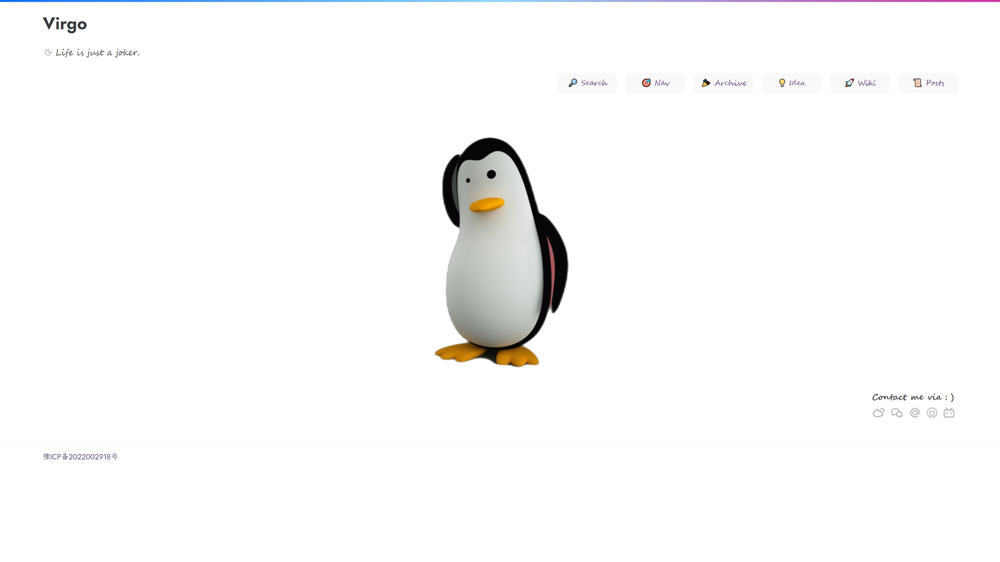
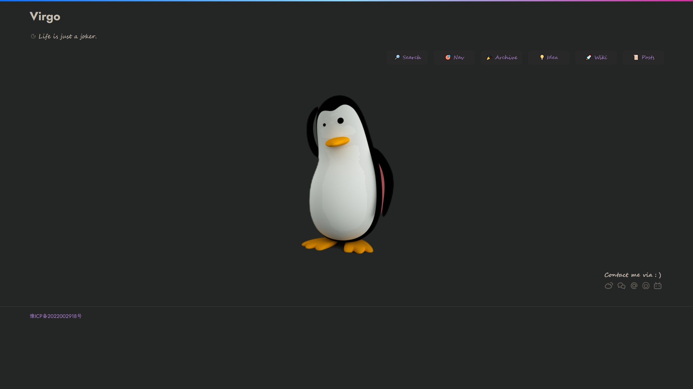
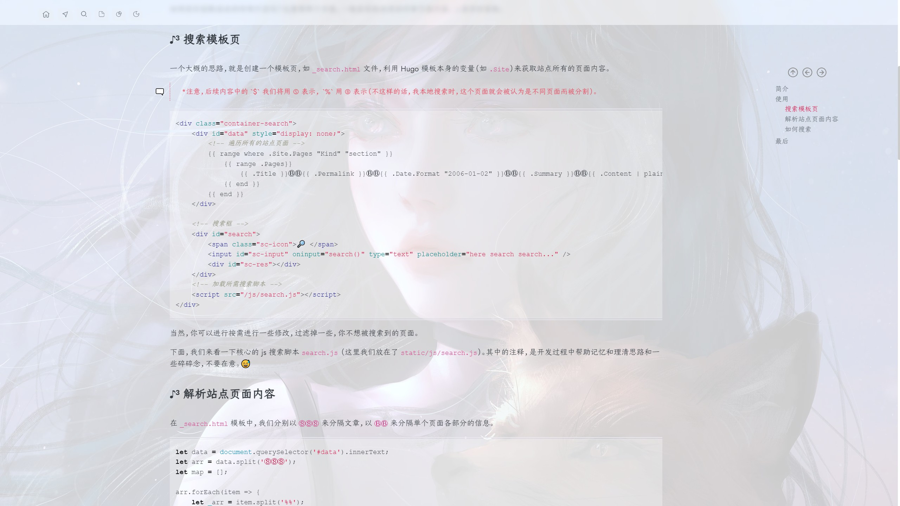
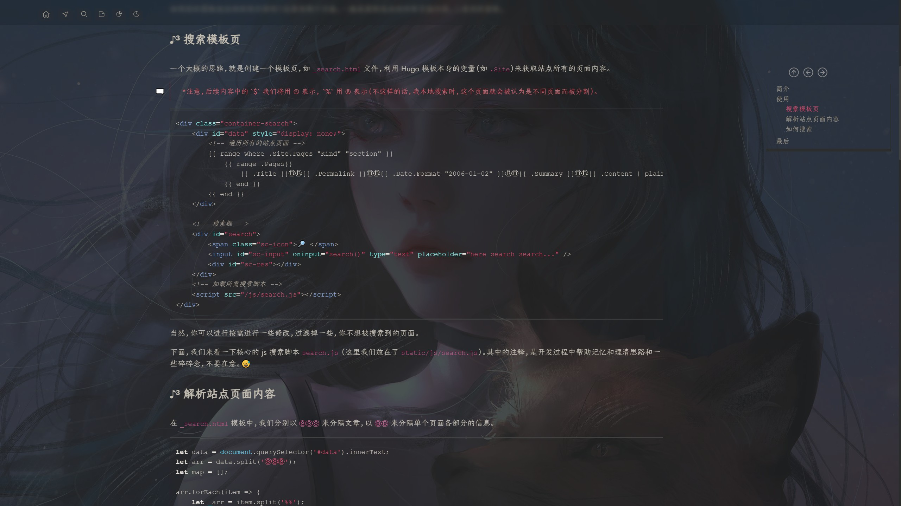
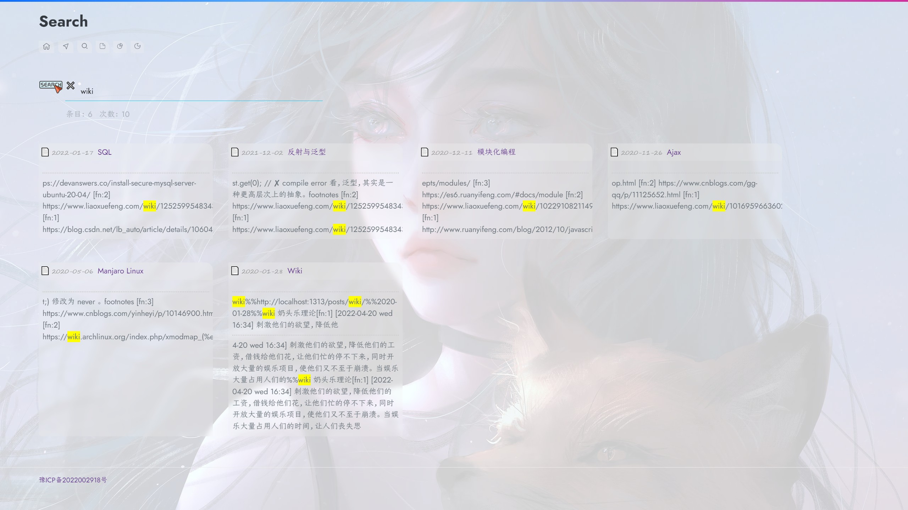
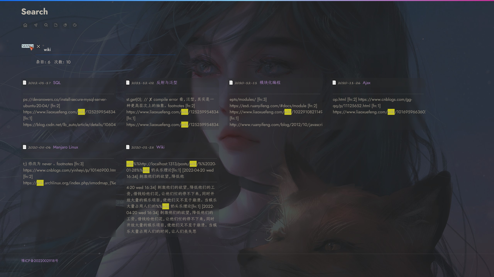

It's just a simple & pure theme. 🎉🎉🎉 Enjoy it.

## Overview

**Cool Style**






**Pure Style**






## Features In-built

**1、A highlight TOC with relative headline, like this:**






**2、A simple and realtime local search.**






## Tips

Maybe you need to create some `.md` files which are necessary for right routes, like:

| Markdown File        | Route      |
| -------------------- | ---------- |
| `content/nav.md`     | `/nav`     |
| `content/search.md`  | `/search`  |
| `content/archive.md` | `/archive` |

## Quick Start

First, let's try to start a interesting journey.

```sh
cd YOUR_SITE_DIR	# your local site workspace
git clone https://github.com/loveminimal/hugo-theme-virgo.git themes/virgo
# OR
cd YOUR_SITE_DIR/themes
git submodule add https://github.com/loveminimal/hugo-theme-virgo.git virgo
```

> Which one to choose? If you have this question, just choose the first. 😏

Then, update your `config.toml` of site, like this:

```
baseURL = 'https://ovirgo.com/'
languageCode = 'zh-cn'
title = 'Virgo'

theme = 'virgo'
hasCJKLanguage = true
summaryLength = 80    # default 70
paginate = 24         # better 4 * 3 * times
enableGitInfo = true

[params]
    # active fadeIn animate when load page
    hasActiveAnimate = true      

    # active cool style, be cool but take up more resources, and
    # if you want to replace default background image, just 
    # rename it `default.jpg` and place it into `/static/imgs/bg` dir, like `/static/imgs/bg/default.jpg`.
    hasActiveCool = true

    # For a better experience, we use localstorage to keep theme dark status, so
    # if you set dark as `true` but has no effect, you
    # should clear local storage of current site. And
    # in general, there has no any questions when you use it firstly.
    dark = false

    # Fold/Unfold code blocks, default `false`, and
    # if `true` ，all code blocks will be folded when page load.
    # It will be always true in Mobile view no matter what's your setting.
    hasFoldAllCodeBlocks = false

    # active english view, default chinese
    en = false

    slogan = 'Life is just a joker.'        # your site slogan below title

    # like the following items that you need create a relative markdown file
    # Search - search.md
    # Nav - nav.md 
    # Archive - archive.md
    # Idea posts/idea.md 
    # Wiki - posts/wiki.md
    [params.menu]
        search = true
        nav = true
        archive = true
        idea = true
        wiki = true


    [params.svg]
        color = '#6c757d'                   # icon color of breadcrumb '#666'  # '#5a29e4' 
    [params.img]
        # Img of home page - if not jpg, rename it, and
        # place it inio `static/imgs/` dir
        # In-built : lightcolor, girl, and tux
        # src = 'tux'
        width = 880
        # and if not want to show img but some words, just 
        # comment `src = 'xxx'`, and input your words:
        # words = "Stay hungry, Stay foolish. Your time is limited, so don't waste it living someone else's life. Have the courage to follow your heart and intuition. They somehow already know what you truly want to become. Everything else is secondary. -- Steve Jobs."
        words = "多少事，从来急；天地转，光阴迫。一万年太久，只争朝夕。 -- 教员"
        # words = "西风烈，长空雁叫霜晨月。霜晨月，马蹄声碎，喇叭声咽。雄关漫道真如铁，而今迈步从头越。从头越，苍山如海，残阳如血。 -- 教员"
        # words = "风雨送春归，飞雪迎春到。已是悬崖百丈冰，犹有花枝俏。俏也不争春，只把春来报。待到山花烂漫时，她在丛中笑。 -- 教员"


    [params.contact]
        icp = '豫ICP备2022002918号'          # beian number
        icplink = '//beian.miit.gov.cn'
        weibo = '6867589681'                # e.g. https://weibo.com/u/6867589681
        wechat = 'imgs/bg/wechat.jpg'       # Wechat QR, choose your path
        email = 'loveminimal@outlook.com'
        github = 'loveminimal'              # e.g. https://github.com/loveminimal
        bilibili = '11608450'               # e.g. https://space.bilibili.com/11608450
        # twitter = 'loveminimal'             # e.g. https://twitter.com/loveminimal
        # facebook = 'loveminimal'            # e.g. https://facebook.com/loveminimal
        # youtube = 'loveminimal'             # e.g. https://youtube.com/user/loveminimal
        color = '#696969'                   # icon color of contact #5d2f86

[markup]
    [markup.asciidocExt]
        preserveTOC = true
    [markup.highlight]
        style = "github"
        lineNos = false
    [markup.tableOfContents]
        endLevel = 3
        ordered = false
        startLevel = 2
    [markup.goldmark]
        [markup.goldmark.renderer]
            unsafe = true

```

And if you want to use nav page, you may need construct it like this:

```md
---
title: "Nav"
draft: false
---

⚓ O virgo, just do the right thingS.
<div class="nav">

- [navitem one](/)
- [navitem two](/archive)
- [navitem three](https://nav-item-three.com)

</div>

🔖 Bookmarks InboX

<div class="bookmark">

- bookmark item one https://bookmark-item-one.com
- bookmark item two https://bookmark-item-two.com
- bookmark item three https://bookmark-item-three.com

</div>
```

Now, just run `hugo server -D` to enjoy it.
